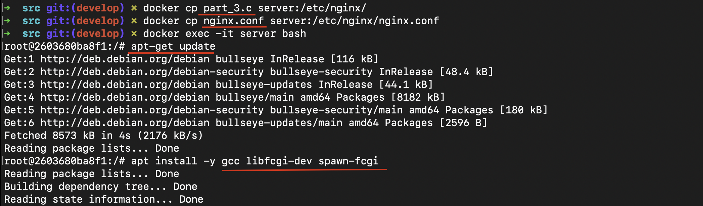
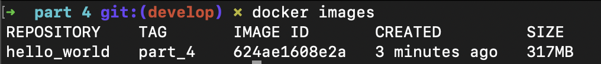
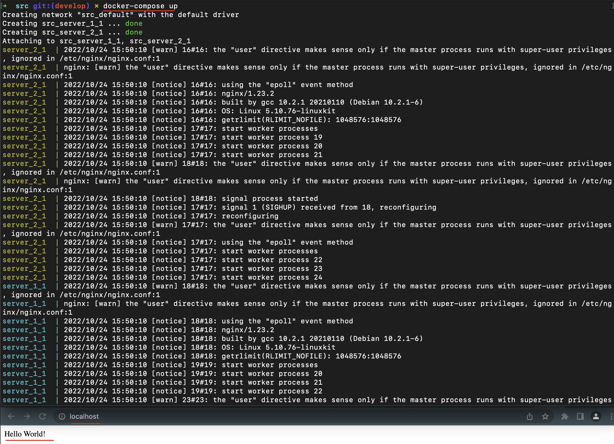

## Part 1. Готовый докер

##### Берем официальный докер образ с **nginx** и выкачиваем его при помощи `docker pull`. Проверим наличие докер образа через `docker images` 
* 
##### Запустим докер образ через `docker run` и проверим, что образ запустился через `docker ps`
* 
##### Далее смотрим информацию о контейнере с помощью `docker inspect`.
Глядя на вывод команды, мы можем определить:
- Размер контейнера: `64 MB`
- Замапленные порты: `80`
- ip-адрес контейнера: `172.17.0.2` 
##### Остановим докер образ через `docker stop` и проверим что образ остановился.
*  \

##### Запустим докер с замапленными портами 80 и 443 на локальную машину через команду *run*
*  
##### Проверим, что в браузере по адресу *localhost:80* доступна стартовая страница **nginx**
*  
##### Перезапустим докер контейнер через `docker restart` и проверим с помощью `docker ps`, что контейнер запустился
* 

## Part 2. Операции с контейнером

##### Прочитаем конфигурационный файл *nginx.conf* внутри докер образа через команду *exec*
* 
##### Создадим на локальной машине файл *nginx.conf* и настроим в нем по пути */status* отдачу страницы статуса сервера **nginx**
* 
##### Скопируем созданный файл *nginx.conf* внутрь докер образа через команду `docker cp` и перезапустим **nginx** внутри докер образа через команду *exec*
* 
##### Проверим, что по адресу *localhost:80/status* отдается страничка со статусом сервера **nginx**
* 
##### Экспортируем контейнер в файл *container.tar* через команду *export*
* 
##### Остановим контейнер, удалим образ через `docker rmi`, не удаляя перед этим контейнеры, а затем удалим остановленный контейнер
* 
##### Импортируем контейнер обратно через команду *import* и запустим импортированный контейнер. Проверим, что по адресу *localhost:80/status* отдается страничка со статусом сервера **nginx**
* 

## Part 3. Мини веб-сервер

##### Напишем мини сервер на **C** и **FastCgi**, который будет возвращать простейшую страницу с надписью `Hello World!`
* 
##### Напишем свой *nginx.conf*, который будет проксировать все запросы с 81 порта на *127.0.0.1:8080*
* 
##### Запустим написанный мини сервер через *spawn-fcgi* на порту 8080
* 
* 
##### Проверим, что в браузере по *localhost:81* отдается написанная страничка
* 

## Part 4. Свой докер

##### Напишем докер образ, который будет собирать исходники мини сервера на FastCgi, запускать его на 8080 порту, копирует внутрь образа написанный ./nginx/nginx.conf и запускает nginx.
* Используем ранее написанный файл для вывода надписи `Hello World!`. Пишем Dockerfile и скрипт. Данный файл выполняет следующие инструкции:
    - Использует базовый образ nginx для сборки
    - Устанавливает рабочую директорию
    - Копирует внутрь контейнера c-файл, nginx.conf и скрипт для компиляции и запуска.
    - Запускает обновление внутри контейнера, устанавливает компилятор gcc, библиотеку fcgi и spawn-fcgi
    - Запускает скрипт

- Dockerfile

- Bash-скрипт

##### Соберем написанный докер образ через `docker build` при этом указав имя и тег
* 
##### Проверим через `docker images`, что все собралось корректно
* 
##### Запустим собранный докер образ с маппингом 81 порта на 80 на локальной машине и маппингом папки *./nginx* внутрь контейнера по адресу, где лежат конфигурационные файлы **nginx**'а и проверим, что по localhost:80 доступна страничка написанного мини сервера
* 
##### Допишем в *./nginx/nginx.conf* проксирование странички */status*, по которой надо отдавать статус сервера **nginx**
* 
##### Перезапустим докер образ и проверим, что теперь по *localhost:80/status* отдается страничка со статусом **nginx**
* 

## Part 5. **Dockle**

##### Просканируем образ из предыдущего задания через `dockle hello_world`
* 
##### Исправим образ так, чтобы при проверке через **dockle** не было ошибок и предупреждений
* 
##### Проверяем:
* 

## Part 6. Базовый **Docker Compose**

##### Напишем файл *docker-compose.yml*:
* 
##### Собираем проект с помощью команды `docker-compose build`
* 
#####  Запускаем проект с помощью команды `docker-compose up` и проверим, что в браузере по *localhost:80* отдается написанная страничка
* 
